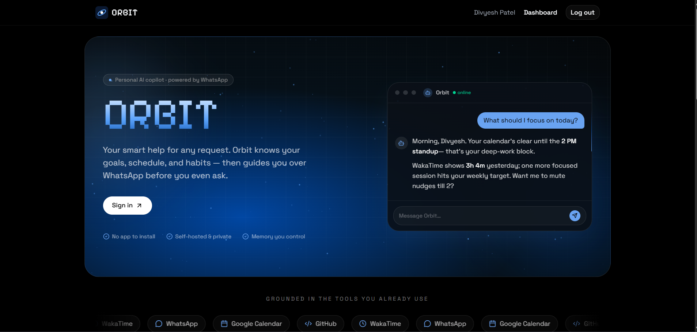

# Orbit

<p align="center">
  
</p>

> A self-hostable personal AI copilot that proactively reaches out over WhatsApp, grounded in your real schedule, coding activity, and a long-term memory that grows with every conversation.

Orbit is a one-user-per-instance AI agent. You connect WhatsApp, Google Calendar, and WakaTime; Orbit builds up a profile + a semantic long-term memory; then it both responds when you message and **initiates** check-ins on its own schedule — every message grounded in fresh context from your connected tools.

This is not a chatbot wrapper. It's an opinionated, full-stack agentic system: function-calling tools, dual reactive/proactive agent modes, a rule-and-model-gated scheduler, encrypted credentials, embedding-based memory retrieval, and a self-hosting-first deployment story.

---

## Highlights

- **Two agent modes from one brain** — `reactive` (you message Orbit) and `proactive` (Orbit messages you) share context assembly and tool bindings, differing only in system prompt and skip-token semantics.
- **Live context from connected tools** — Google Calendar (today's events + free blocks) and WakaTime (yesterday's coding + 7-day trend) feed into every prompt as a dedicated `## Live activity` section, refreshed by an in-process scheduler.
- **Semantic long-term memory** — facts auto-extracted from each chat turn, stored with `gemini-embedding-001` vectors (768-dim, MRL-truncated), retrieved by cosine similarity against the current message instead of blind top-N-by-importance.
- **Function-calling tools the agent actually uses** — `snooze_check_ins`, `update_goals`, `add_memory`, `archive_memory`, `get_calendar_events`. Tool registry conditionally binds calendar tool only when Calendar is connected, so the model never sees dead tools.
- **Proactive scheduler with two gates** — a 15-minute cron tick walks all users, runs rule-based eligibility (frequency, quiet hours, snooze, interval since last nudge), and only then asks Gemini in proactive mode — which can still return `<SKIP>` if there's nothing useful to say.
- **Self-hosting lockdown** — `ALLOW_REGISTRATION=false` after creating your account; frontend auto-hides Sign-up CTAs via a public `/api/config` endpoint.
- **Encrypted credentials at rest** — Fernet (`INTEGRATION_ENCRYPTION_KEY`) for WakaTime API keys, Google OAuth refresh + access tokens.
- **Production-ready deploy** — Docker + Caddy auto-TLS on AWS EC2 (the path documented in [docs/deployment.md](docs/deployment.md)). Also works on Railway / Render / Fly / VPS.

---

## At a glance

| Layer | Choice |
| --- | --- |
| Backend | FastAPI (Python 3.11+) — async throughout |
| Frontend | Next.js App Router + Tailwind v4 + shadcn-style components |
| Database | MongoDB Atlas (Beanie async ODM on Motor, `tz_aware=True`) |
| Auth | bcrypt + JWT bearer (`python-jose`) |
| AI | Gemini (`google-genai` SDK) — `gemini-2.0-flash` for chat, `gemini-embedding-001` for memory |
| Messaging | Twilio WhatsApp (sandbox in dev, Meta Cloud API optional later) |
| Scheduler | In-process asyncio tasks in the FastAPI lifespan |
| Deploy | Docker + Caddy on EC2 (also Railway/Render/Fly) |

---

## Architecture

```
                    ┌──── WhatsApp (Twilio) ────┐
                    │                            │
                    ▼                            │
            POST /api/webhook                    │ outbound message
                    │                            │
   ┌────────────────┴──── FastAPI ───────────────┴──────────────┐
   │                                                            │
   │  Reactive path      ←─── Dashboard chat / WhatsApp webhook │
   │     │                                                      │
   │     ▼                                                      │
   │  assemble_context(user, query=msg)                         │
   │     │  ├─ semantic memory retrieval (cosine)               │
   │     │  ├─ live signals (Calendar / WakaTime)               │
   │     │  ├─ recent history                                   │
   │     │  └─ "## Right now" time block                        │
   │     ▼                                                      │
   │  Gemini tool-calling loop                                  │
   │     │  ├─ snooze_check_ins                                 │
   │     │  ├─ update_goals                                     │
   │     │  ├─ add_memory / archive_memory                      │
   │     │  └─ get_calendar_events (if Calendar linked)         │
   │     ▼                                                      │
   │  Save turn + background memory extraction                  │
   │                                                            │
   │  Proactive path     ←─── in-process scheduler (every 15m)  │
   │     │                                                      │
   │     ▼                                                      │
   │  For each user: rule gate (freq/snooze/quiet)              │
   │     │                                                      │
   │     ▼                                                      │
   │  Same assemble_context + system prompt addendum            │
   │     │                                                      │
   │     ▼                                                      │
   │  Send via WhatsApp OR drop into Dashboard chat inbox       │
   │                                                            │
   │  Integration sync   ←─── in-process scheduler (every 60m)  │
   │     │                                                      │
   │     └── WakaTime + Google Calendar → LongTermContext       │
   │                                                            │
   └────────────────────────────────────────────────────────────┘
                              │
                              ▼
                       MongoDB Atlas
```

---

## Quick start (local dev)

### 1. Backend

```bash
cd server
python -m venv .venv && source .venv/bin/activate  # or .venv\Scripts\activate on Windows
pip install -r requirements.txt
cp .env.example .env
# fill in MONGODB_URI, JWT_SECRET_KEY, GEMINI_API_KEY, INTEGRATION_ENCRYPTION_KEY
# Generate INTEGRATION_ENCRYPTION_KEY:
#   python -c "from cryptography.fernet import Fernet; print(Fernet.generate_key().decode())"
uvicorn app.main:app --reload --port 8000
```

Verify: `curl http://localhost:8000/health` → `{"status":"ok","db":"reachable"}`.

### 2. Frontend

```bash
cd client
npm install
cp .env.local.example .env.local
# default NEXT_PUBLIC_API_URL=http://localhost:8000 is fine for local
npm run dev
```

Open http://localhost:3000, register, log in.

### 3. (Optional) WhatsApp via Twilio sandbox

- Sign up at https://twilio.com, join the WhatsApp sandbox.
- Fill `TWILIO_*` in `server/.env`.
- Use `ngrok http 8000` to expose your server, then set the Twilio webhook to `https://<ngrok>/api/webhook/whatsapp`.
- Add your phone in Dashboard → Messaging.

### 4. (Optional) Connect Google Calendar

Follow [docs/google_calendar_setup.md](docs/google_calendar_setup.md) — 5 minutes in the Google Cloud Console.

### 5. (Optional) Connect WakaTime

Grab your API key at https://wakatime.com/api-key, paste it into the Integrations tab.

---

## Self-hosting in production

The full walkthrough lives in [docs/deployment.md](docs/deployment.md). Two paths documented:

- **AWS EC2 + Vercel** (recommended for AWS-credit users): Docker + Caddy auto-TLS on EC2, Next.js on Vercel.
- **Railway + Vercel** (managed alternative): single Railway service, zero infra config.

In either case, you'll want to:

1. Generate fresh `JWT_SECRET_KEY`, `INTEGRATION_ENCRYPTION_KEY`, `CRON_SECRET` for production.
2. Set `TWILIO_VALIDATE_SIGNATURES=true` and `ENABLE_DEV_ROUTES=false`.
3. After creating your own account, set `ALLOW_REGISTRATION=false` to lock the public URL.

---

## Repository layout

```
orbit/
├── context.md                    # Architecture brief (for collaborators / Claude / future you)
├── README.md                     # This file
├── docs/
│   ├── deployment.md             # AWS EC2 + Vercel + Railway walkthroughs
│   └── google_calendar_setup.md  # Google Cloud OAuth client setup
├── deploy/                       # docker-compose + Caddyfile for EC2
│   ├── docker-compose.yml
│   ├── Caddyfile
│   └── .env.example
├── server/                       # FastAPI backend
│   ├── Dockerfile
│   ├── Procfile                  # Railway/Render fallback
│   ├── railway.toml
│   ├── requirements.txt
│   ├── .env.example
│   └── app/
│       ├── main.py
│       ├── core/                 # config, database, security, encryption, timezone
│       ├── models/               # Beanie Documents (User, Integration, LongTermContext, ConversationMessage)
│       ├── schemas/              # Pydantic API request/response shapes
│       ├── api/
│       │   ├── deps.py
│       │   ├── deps_cron.py
│       │   └── routes/           # auth, chat, context, conversations, cron, dev, health,
│       │                         # integrations, public_config, users, webhook
│       ├── integrations/
│       │   ├── whatsapp/twilio.py
│       │   ├── wakatime/         # client.py, sync.py
│       │   └── google_calendar/  # oauth.py, client.py, sync.py
│       └── services/
│           ├── brain.py          # process_message + process_proactive_check_in
│           ├── channels.py       # InteractionChannel enum
│           ├── conversation.py
│           ├── embeddings.py     # gemini-embedding-001 + cosine
│           ├── gemini.py         # tool-calling loop
│           ├── memory_backfill.py
│           ├── memory_extraction.py
│           ├── integration_sync.py
│           ├── prompt.py         # system instructions per mode
│           ├── proactive.py      # cron-level "should I message you" orchestrator
│           ├── scheduler.py      # in-process asyncio scheduler
│           ├── scheduling.py     # per-user eligibility logic
│           ├── user_context.py   # load_user_memories + load_live_signals
│           ├── context/          # ContextBundle + section renderers
│           └── tools/            # snooze, update_goals, add_memory, archive_memory,
│                                 # calendar_events + registry
└── client/                       # Next.js dashboard
    ├── package.json
    └── src/
        ├── app/                  # / (landing), /login, /register, /dashboard
        ├── components/
        │   ├── auth/             # login-form, register-form, phone input
        │   ├── dashboard/        # chat-tab, profile-tab, memory-tab, messaging-settings-tab,
        │   │                     # integrations-tab, dashboard-sidebar, chat-markdown
        │   └── ui/               # base UI primitives
        ├── contexts/             # auth-context (JWT + serverConfig)
        ├── lib/                  # api, chat-api, conversation-api, context-api,
        │                         # integrations-api, server-config-api, phone, format
        └── types/                # auth, conversation, context, integration, user
```

---

## API surface

| Method | Path | Auth | Purpose |
| --- | --- | --- | --- |
| `GET` | `/health` | — | Liveness + Mongo ping |
| `GET` | `/api/config` | — | Public config (e.g. `allow_registration`) |
| `POST` | `/api/auth/register` | — | Create account (gated by `ALLOW_REGISTRATION`) |
| `POST` | `/api/auth/login` | — | OAuth2 password form → JWT |
| `GET` | `/api/auth/me` | JWT | Lightweight current-user info |
| `GET` `PATCH` | `/api/users/me` | JWT | Full profile read + partial update |
| `GET` `POST` | `/api/context` | JWT | Long-term memory CRUD |
| `GET` `PATCH` `DELETE` | `/api/context/{id}` | JWT | Per-memory ops (DELETE = archive) |
| `POST` | `/api/chat` | JWT | Dashboard chat → reactive brain |
| `GET` | `/api/conversations/messages` | JWT | Chat history (filterable by channel) |
| `GET` `POST` `DELETE` | `/api/integrations` | JWT | List / connect (WakaTime) / disconnect |
| `POST` | `/api/integrations/{id}/sync` | JWT | Manual sync for any provider |
| `POST` | `/api/integrations/oauth/google_calendar/start` | JWT | Returns Google authorization URL |
| `GET` | `/api/integrations/oauth/google_calendar/callback` | state JWT | OAuth callback → tokens → redirect to dashboard |
| `POST` | `/api/webhook/whatsapp` | Twilio sig | Inbound WhatsApp → reactive brain |
| `POST` | `/api/cron/sync` | `CRON_SECRET` | Re-sync all integrations |
| `POST` | `/api/cron/nudge` | `CRON_SECRET` | Run proactive check-ins for due users |
| `POST` | `/api/dev/chat` | dev gate | No-auth chat (local testing) |
| `POST` | `/api/dev/proactive-nudge` | JWT + dev gate | Force-fire proactive for current user |
| `GET` | `/api/dev/context` | JWT + dev gate | Inspect the prompt Gemini would receive |
| `POST` | `/api/dev/backfill-embeddings` | JWT + dev gate | Embed any unembedded memories |

The `/api/cron/*` routes are an alternative to the built-in in-process scheduler — useful when running multiple replicas. With `BACKGROUND_SCHEDULER_ENABLED=true` (default), you don't need to call them.

---

## Configuration

All server settings are in [server/.env.example](server/.env.example). The ones that matter most:

| Var | What it does |
| --- | --- |
| `MONGODB_URI` | Atlas connection string |
| `JWT_SECRET_KEY` | Signing key for session JWTs (regenerate per deploy) |
| `INTEGRATION_ENCRYPTION_KEY` | Fernet key for at-rest credential encryption — **write once, never rotate** |
| `CRON_SECRET` | Bearer token for `/api/cron/*` routes (only needed for external schedulers) |
| `GEMINI_API_KEY` | Google AI Studio key |
| `TWILIO_*` | WhatsApp sandbox creds + signed-webhook toggle |
| `GOOGLE_OAUTH_*` | OAuth client for Calendar — see [docs/google_calendar_setup.md](docs/google_calendar_setup.md) |
| `ALLOW_REGISTRATION` | Set to `false` after you create your account; closes `/api/auth/register` |
| `ENABLE_DEV_ROUTES` | Gates `/api/dev/*` — `false` in production |
| `BACKGROUND_SCHEDULER_ENABLED` | In-process scheduler on/off |
| `SCHEDULER_SYNC_INTERVAL_MINUTES` | Default 60 |
| `SCHEDULER_NUDGE_INTERVAL_MINUTES` | Default 15 |
| `FRONTEND_URL` | Used for OAuth-callback redirects back to the dashboard |
| `CORS_ORIGINS` | Comma-separated frontend origins |

---

## Status

Built end-to-end:

- [x] WhatsApp + dashboard chat over a unified brain
- [x] Auth, profile, memory CRUD, conversation history
- [x] WakaTime + Google Calendar connectors (OAuth + manual sync)
- [x] In-process scheduler (sync + proactive nudges) with rule gates
- [x] Reactive + proactive agent modes
- [x] Function-calling tools: snooze, goal/memory CRUD, calendar fetch
- [x] AI memory write-back (auto-extract durable facts from each turn)
- [x] Semantic memory retrieval (Gemini embeddings + cosine)
- [x] Self-hosting lockdown (`ALLOW_REGISTRATION`)
- [x] AWS EC2 + Docker + Caddy deploy artifacts

In progress / next:

- [ ] Memory update-on-conflict (when a new memory semantically overlaps an existing one, merge instead of insert)
- [ ] Memory edit / archive UI in the dashboard
- [ ] GitHub connector (commits, PRs, streaks)
- [ ] Onboarding flow (profile completeness, integration connect checklist)
- [ ] Twilio Meta Cloud API (alternative to the sandbox)

---

## License

Personal-use project. No license declared — fork freely for your own self-hosted instance, but don't redistribute as your own product.
