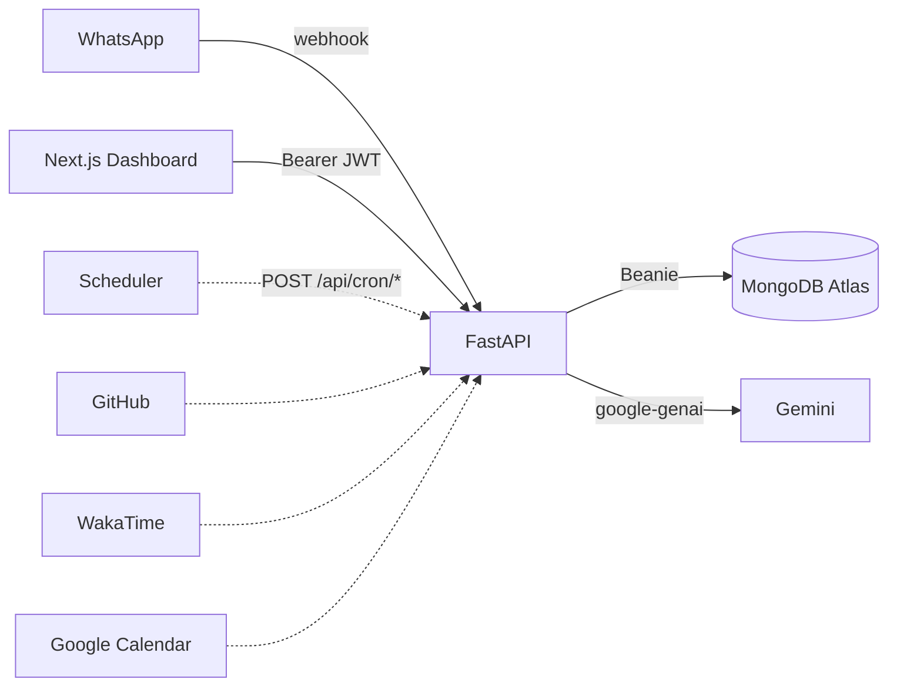

# Orbit — Project Context

## North Star

Build a personal AI copilot that helps its human get the **best output from their life** by knowing them deeply — profile, habits, goals, health, work, schedule, and live signals from connected tools — then guiding them proactively over WhatsApp.

**Core principle:** More accurate, timely context → better advice, nudges, and accountability.

**Success looks like:** Orbit knows who you are, what you're working toward, what happened yesterday (GitHub, WakaTime, Calendar), remembers what you told it weeks ago, and sends the right message at the right time — without you opening another app.

---

## Role and Objective

Act as a **Senior Full-Stack Engineer** specializing in event-driven serverless architectures, AI agent workflows, and the MERN stack.

We are building **Orbit** — a scalable, zero-maintenance prototype designed for self-hosting. It must be:

- Resilient against server cold starts
- Highly modular so new data connectors can be added easily
- Fast on the WhatsApp webhook path (under 10–15 seconds)

---

## Tech Stack

| Layer | Choice |
| --- | --- |
| Backend API | FastAPI (Python) — webhooks, cron, AI, DB, auth |
| Frontend Dashboard | Next.js (App Router) — settings UI only, calls FastAPI |
| Backend Hosting | Railway, Render, Fly.io, or VPS (Python runtime; not Vercel) |
| Frontend Hosting | Vercel |
| Database | MongoDB Atlas (Beanie async ODM on Motor) |
| Auth | bcrypt password hashing + JWT bearer tokens (`python-jose`, `passlib`) |
| AI Engine | Gemini API (`google-genai` Python SDK) |
| Interface | Twilio API for WhatsApp (Meta Cloud API optional later) |
| UI Library | Tailwind CSS v4, shadcn/ui (dashboard) |

---

## Repository Layout

```
orbit/
  context.md
  server/
    app/
      main.py
      core/           # config, database, security, phone, timezone, time_value
      models/         # Beanie Documents (MongoDB)
      schemas/        # Pydantic API request/response shapes
      services/       # brain, channels, conversation, gemini, prompt, user_context
      integrations/
        whatsapp/     # Twilio inbound/outbound + signature validation
      api/
        deps.py       # get_current_user (JWT)
        routes/       # health, auth, users, context, chat, conversations, webhook, dev
    requirements.txt
    .env.example
  client/
    src/
      app/            # App Router pages (/, /login, /register, /dashboard)
      components/     # auth, dashboard (5 tabs), ui, site-header
      contexts/       # auth-context (JWT session)
      lib/            # api, auth, users, chat-api, conversation-api, context-api, phone, location-options
      types/          # TypeScript API types
    .env.local.example
```

---

## Models vs Schemas

| Layer | Location | Purpose |
| --- | --- | --- |
| **Models** | `server/app/models/` | Beanie `Document` classes — what is stored in MongoDB (includes secrets like `password_hash`) |
| **Schemas** | `server/app/schemas/` | Pydantic `BaseModel` classes — what the HTTP API accepts and returns (never exposes `password_hash`) |
| **Profile embeds** | `server/app/models/user_profile.py` | Shared nested types (`UserContact`, `UserHealth`, `WorkEntry`, etc.) reused by both models and schemas |

Route handlers translate between them (e.g. `User` document → `UserDetailResponse` schema).

`PATCH /api/users/me` applies updates via Pydantic `model_fields_set` (not `model_dump`) so nested models stay typed and contact email sync works.

---

## Database Models (Beanie)

### `User` (`users` collection)

Rich profile document with nested sections:

- **contact** — email, phone, WhatsApp number (WhatsApp indexed unique/sparse for webhook lookup)
- **identity** — display/legal/preferred name, DOB, gender, bio, avatar
- **location** — IANA timezone (validated), locale, city, region, country, nationality, languages
- **goals** — life mission, **personal goals**, short/long-term goal items, focus areas, weekly priorities
- **habits** — morning/evening routines, tracked habits, habits to build/break
- **health** — fitness, sleep target, bedtime/wake (stored as `HH:MM:SS` strings), diet, allergies, conditions, medications, health goals, notes
- **work** — **multiple roles** (`WorkEntry[]`: occupation, employer, mode, hours, projects, `is_primary`); shared skills, productivity goals, career goals. Legacy single-job shape auto-migrates on load.
- **orbit_preferences** — communication style, check-in frequency, proactive nudges, topics to avoid, custom instructions
- **emergency** — emergency contacts and notes
- **password_hash** — bcrypt only; never returned via API
- **is_active**, **is_verified**, timestamps

Time fields (`work_hours_*`, `typical_bedtime`, `typical_wake_time`) are **strings**, not Python `time` objects — Beanie/MongoDB cannot encode `datetime.time`.

### `ConversationMessage` (`conversation_messages` collection)

Stored chat turns for continuity and the Memory tab:

- **user** (Link to User), **role** (`user` | `assistant`), **content**, **channel** (`whatsapp` | `dashboard` | `dev`)
- **external_id** (optional, e.g. Twilio message SID), **created_at**
- Indexed by `(user, created_at)` and `(user, channel, created_at)`

### `LongTermContext` (`long_term_context` collection)

Persistent memory for Gemini prompt injection, linked to a user:

- **context_type** — `fact`, `preference`, `habit`, `health`, `work`, `relationship`, `goal_progress`, `conversation_summary`, `insight`, `other`
- **title**, **content**, **summary** (optional short form for token limits)
- **importance** (1–10), **confidence**, **source**, **source_ref**, **tags**, **metadata**
- **source** values include: `user`, `ai_inferred`, `github`, `wakatime`, `google_calendar`, `cron_sync`
- **expires_at**, **is_archived**, **access_count**, **last_accessed_at**

### `Integration` (`integrations` collection)

- **user** (Link to User), **provider** (`github` | `wakatime` | `google_calendar`)
- **credentials** (dict), **status** (`active` | `inactive`)
- Token encryption at rest is still TODO.
- **No API routes or sync logic yet** — model only.

---

## API Endpoints (Current)

| Method | Path | Auth | Status |
| --- | --- | --- | --- |
| `GET` | `/health` | No | Done |
| `POST` | `/api/webhook/whatsapp` | No (Twilio sig optional) | Done — unified brain + Twilio outbound |
| `POST` | `/api/auth/register` | No | Done |
| `POST` | `/api/auth/login` | No | Done (form: `username`=email) |
| `GET` | `/api/auth/me` | Bearer | Done |
| `GET` | `/api/users/me` | Bearer | Done |
| `PATCH` | `/api/users/me` | Bearer | Done — partial profile updates |
| `GET/POST` | `/api/context` | Bearer | Done |
| `GET/PATCH/DELETE` | `/api/context/{id}` | Bearer | Done (DELETE archives) |
| `POST` | `/api/chat` | Bearer | Done — dashboard AI chat |
| `GET` | `/api/conversations/messages` | Bearer | Done — query `channel`, `limit` |
| `POST` | `/api/dev/chat` | No (gated by `ENABLE_DEV_ROUTES`) | Done — test AI without auth |
| `GET/POST/PATCH/DELETE` | `/api/integrations/*` | Bearer | Not built |
| `POST` | `/api/cron/sync` | Cron secret | Not built |
| `POST` | `/api/cron/nudge` | Cron secret | Not built |

Protected routes require header: `Authorization: Bearer <JWT>`.

---

## Environment Variables

```env
MONGODB_URI=...
MONGODB_DB_NAME=orbit
JWT_SECRET_KEY=...

GEMINI_API_KEY=...
GEMINI_MODEL=gemini-2.0-flash

TWILIO_ACCOUNT_SID=...
TWILIO_AUTH_TOKEN=...
TWILIO_WHATSAPP_FROM=whatsapp:+14155238886
TWILIO_WEBHOOK_URL=https://your-ngrok-url.ngrok.io/api/webhook/whatsapp
TWILIO_VALIDATE_SIGNATURES=false

CORS_ORIGINS=http://localhost:3000,http://127.0.0.1:3000
ENABLE_DEV_ROUTES=true
```

Planned (not in `.env.example` yet):

```env
CRON_SECRET=...              # Bearer or header auth for scheduled jobs
INTEGRATION_ENCRYPTION_KEY=...  # Fernet for connector tokens at rest
```

**Dev notes:** Use Twilio sandbox number `whatsapp:+14155238886` in dev. Install `tzdata` on Windows for IANA timezone validation. Run ngrok for webhook testing.

---

## System Architecture & Core Flows

### 1. Unified AI core (`process_message`)

All channels share one path in `server/app/services/brain.py`:

```
Inbound message (WhatsApp webhook | POST /api/chat | POST /api/dev/chat)
    → process_message(message, user, channel)
    → load_user_memories (top 12 by importance)
    → load_recent_messages (last N turns)
    → build_gemini_contents (profile + memories + history + message)
    → generate_orbit_reply (Gemini)
    → save_conversation_turn (user + assistant messages)
    → return OrbitInteractionResult
```

**Channels:** `InteractionChannel` in `server/app/services/channels.py` — `whatsapp`, `dashboard`, `dev`.

**Key files:** `brain.py`, `prompt.py`, `conversation.py`, `gemini.py`, `user_context.py`

### 2. WhatsApp Webhook Loop (reactive)

```
Twilio POST → validate_twilio_request (optional)
           → parse_twilio_form → find_user_by_whatsapp
           → process_message (channel=whatsapp)
           → send_whatsapp_message (Twilio REST, errors caught)
           → 200 OK (prevents Twilio retry storms)
```

**Gaps:** No integration data in prompt, no AI memory write-back after conversations.

### 3. Integration Engine (proactive — cron pulls live signals)

**Target flow (not built):**

```
External scheduler (Railway cron / GitHub Actions / cron-job.org)
    → POST /api/cron/sync (CRON_SECRET)
    → For each user with active integrations:
        → Fetch GitHub / WakaTime / Google Calendar
        → Normalize into LongTermContext entries (source = provider or cron_sync)
        → Optionally trigger proactive nudge if rules match
    → Store sync timestamps on Integration documents
```

**Why cron before on-demand:** Webhook must stay fast; connector API calls belong in background jobs.

### 4. Context Assembly (the brain's input)

Everything Orbit knows about a user funnels into one **context bundle** before Gemini:

| Source | Status | Priority for life optimization |
| --- | --- | --- |
| User profile (goals, personal goals, habits, health, work roles, prefs) | In prompt today | High — static identity |
| Location block (city/region/country, timezone, **local time**, locale, languages) | In prompt today | High — time-aware responses |
| Long-term memory (manual + AI-inferred) | In prompt today (top 12) | High — learned facts |
| Recent conversation (last N turns) | In prompt today | High — continuity |
| Integration snapshots (today's calendar, yesterday's commits, WakaTime) | Not built | High — live signals |
| Health & habits summary (fitness, sleep, routines) | In prompt today | Medium |

**Target:** `assemble_context(user_id) -> ContextBundle` used by both webhook and cron/nudge paths.

### 5. Web Dashboard (Next.js)

Control panel organized into **five tabs** (sidebar layout; logo + auth in sidebar):

| Tab | Purpose | Status |
| --- | --- | --- |
| **Chat** (default) | Full-page ChatGPT-style UI; same brain as WhatsApp | Done (history saved server-side; chat tab reload not wired yet) |
| **Profile** | Identity, location (dropdowns), goals, work (multi-role), health & habits, Orbit prefs | Done |
| **Memory** | Long-term memory + WhatsApp/dashboard conversation history | Partial (history read works; edit/archive/sync UI incomplete) |
| **Messaging & automation** | WhatsApp number, check-in frequency, proactive nudges, cron preview | Partial (cron jobs not built) |
| **Integrations** | GitHub, WakaTime, Google Calendar connect cards | UI placeholder |

JWT auth against FastAPI. WhatsApp editing lives in Messaging tab (read-only hint in Profile contact).

**Profile UI details:**
- Location: country, timezone, locale, languages as dropdowns; city/region as text
- Work: add/remove roles, mark one primary
- Goals: includes personal goals (list), short/long-term, focus areas, weekly priorities

**Gaps:** Reload chat UI after send, memory edit/archive UI, integration connect flows, live cron status.



---

## Implementation Phases

### Phase 1: Foundation & Webhook — **Done**

- [x] FastAPI server, MongoDB (Beanie + Motor), health check
- [x] Twilio WhatsApp inbound webhook + outbound send
- [x] Twilio signature validation (configurable, off in dev)
- [x] Outbound send error handling (webhook returns 200 even if send fails)
- [ ] Meta WhatsApp Cloud API (alternative provider)

### Phase 2: The Brain — **Mostly done**

- [x] Gemini SDK integration (`google-genai`)
- [x] Unified `process_message()` for WhatsApp, dashboard chat, dev chat
- [x] System prompt + rich user profile + long-term memory injection
- [x] Location context with user's local date/time
- [x] Work roles, health/habits, personal goals in prompt
- [x] Conversation history — `ConversationMessage` model, save/load, inject last N turns
- [x] `POST /api/chat`, `GET /api/conversations/messages`
- [x] `POST /api/dev/chat` for local testing
- [ ] **Smarter memory retrieval** — relevance + recency + importance, not just top-12
- [ ] **AI memory write-back** — persist insights/summaries after conversations
- [ ] **Prompt optimization** — token budget, structured sections, model selection
- [ ] Twilio signature validation enabled in production

### Phase 3: Database & State — **Done**

- [x] Beanie models: `User`, `Integration`, `LongTermContext`, `ConversationMessage`
- [x] Auth: register, login, JWT, protected routes
- [x] Profile + context CRUD APIs
- [x] Webhook user resolution by WhatsApp number
- [x] Profile PATCH fixes (nested models, time-as-string for MongoDB)

### Phase 4: Dashboard — **Mostly done**

- [x] Next.js app with auth, landing page (violet theme), dashboard sidebar layout
- [x] Five-tab layout: Chat (default), Profile, Memory, Messaging & automation, Integrations
- [x] Dashboard AI chat (`POST /api/chat`) — same brain as WhatsApp
- [x] Profile editing (all sections via PATCH /api/users/me)
- [x] Location/timezone/locale dropdowns (`client/src/lib/location-options.ts`)
- [x] Multi-role work editor, personal goals field
- [x] Memory tab: conversation history by channel (WhatsApp / dashboard / all)
- [x] Messaging tab: WhatsApp number, check-in prefs, cron preview (coming soon)
- [ ] Chat tab reload history after send (stay in sync with Memory)
- [ ] Memory edit / archive / search UI
- [ ] Integration connect flows (UI wired to API)
- [ ] Onboarding checklist (profile completeness, WhatsApp linked, first memory)

### Phase 5: Connectors — **Not started**

- [ ] `/api/integrations` CRUD (connect, disconnect, list status)
- [ ] Credential encryption at rest (`INTEGRATION_ENCRYPTION_KEY`)
- [ ] Connector module pattern: `server/app/integrations/{provider}/`
- [ ] **First connector: WakaTime** (API key — simplest auth)
- [ ] **Second connector: GitHub** (PAT or OAuth)
- [ ] **Third connector: Google Calendar** (OAuth — hardest)
- [ ] Dashboard connect buttons → real OAuth/API-key flows

### Phase 6: Cron & Proactive Nudges — **Not started**

- [ ] `CRON_SECRET` auth middleware for cron routes
- [ ] `POST /api/cron/sync` — pull all active integrations for all users
- [ ] Write sync results to `LongTermContext` with provider source + TTL
- [ ] `POST /api/cron/nudge` — evaluate who needs a check-in; send WhatsApp
- [ ] Nudge rules engine (respects `orbit_preferences.check_in_frequency`, timezone, quiet hours)
- [ ] External scheduler setup (Railway cron or GitHub Actions)

### Phase 7: Context Engine & Model Quality — **Ongoing**

- [ ] Unified `assemble_context()` service
- [ ] Token budget manager (truncate/summarize by priority)
- [ ] Evaluation harness (dev route or script with sample scenarios)
- [ ] Model A/B or fallback (`gemini-2.0-flash` vs lite vs pro by task)
- [ ] Structured output for nudges (JSON plan → human-readable WhatsApp message)

---

## Recommended Build Order (Next)

Priority is **maximize context quality** before adding more surface area.

### Sprint 1 — Polish the brain & dashboard loop (**partially done**)

1. ~~**Conversation history model**~~ — `ConversationMessage` + save/load
2. ~~**Inject last N turns** into Gemini prompt~~
3. **Chat tab reload** — fetch history after send so Chat and Memory stay in sync
4. **Post-reply memory extraction** — optional Gemini call to save `insight` / `conversation_summary` entries
5. **Smarter memory selection** — query by tags, recency, and message relevance

*Why first:* WhatsApp and dashboard chat work; finishing the UI loop and memory write-back makes Orbit feel much smarter without new infra.

### Sprint 2 — First connector + cron skeleton (1–2 weeks)

1. **`/api/integrations`** + encrypt credentials
2. **WakaTime connector** — fetch yesterday's coding stats → `LongTermContext`
3. **`POST /api/cron/sync`** with `CRON_SECRET`
4. **Inject latest sync data** into `format_user_context()`
5. **Dashboard:** WakaTime API key connect form

*Why WakaTime first:* Single API key, no OAuth, immediate productivity signal.

### Sprint 3 — Proactive nudges (1 week)

1. **`POST /api/cron/nudge`** — morning check-in, weekly review
2. Rules: timezone-aware, respect user prefs, don't spam
3. Schedule via Railway cron or GitHub Actions

*Why now:* Connectors + cron sync give nudges something concrete to say ("You coded 2h yesterday, goal is 4h").

### Sprint 4 — GitHub + Calendar + polish

1. GitHub connector (commits, PRs, streaks)
2. Google Calendar OAuth (today's events, free blocks)
3. Prompt evaluation harness
4. Production hardening (Twilio sig, remove debug prints, rate limits)

---

## Development Rules

1. **Modularity** — Gemini prompting separate from webhook routing; connectors as pluggable modules; models separate from schemas.
2. **Serverless-first** — No in-memory state across requests.
3. **Prioritize speed** — Webhook path under timeout; heavy work in cron.
4. **Strictly typed code** — Python (server) and TypeScript (client).
5. **Security** — Never expose secrets in API responses; encrypt integration credentials; protect cron with secret.
6. **Context is the product** — Every feature should answer: "Does this give Orbit more useful context about the user?"

---

## Working Agreement

- The user will provide step-by-step instructions; do not jump phases ahead without agreement.
- Do **not** remove existing functionality while adding new features.
- Do **not** remove any existing comments.
- Do **not** add new comments unless explicitly told to.
