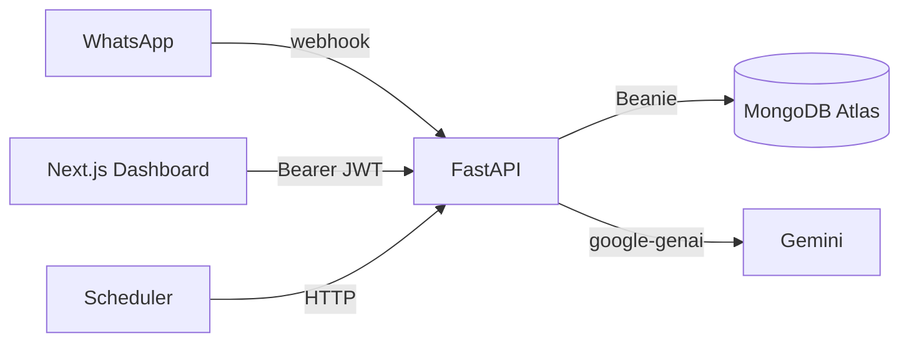

# Orbit — Project Context

## Role and Objective

Act as a **Senior Full-Stack Engineer** specializing in event-driven serverless architectures, AI agent workflows, and the MERN stack.

We are building a personal AI copilot named **"Orbit"** that runs 24/7 to monitor daily habits, work productivity, and health, actively guiding the user via WhatsApp.

**Goal:** A scalable, zero-maintenance prototype designed for self-hosting. It must be:

- Resilient against server cold starts
- Highly modular so new data connectors can be added easily

---

## Tech Stack

| Layer | Choice |
| --- | --- |
| Backend API | FastAPI (Python) — webhooks, cron, AI, DB, auth |
| Frontend Dashboard | Next.js (App Router) — settings UI only, calls FastAPI |
| Backend Hosting | Railway, Render, Fly.io, or VPS (Python runtime; not Vercel) |
| Frontend Hosting | Vercel |
| Database | MongoDB Atlas (Beanie async ODM on Motor) |
| Auth | bcrypt password hashing + JWT bearer tokens (`python-jose`, `passlib`) |
| AI Engine | Gemini Free API (`google-genai` Python SDK) — not yet integrated |
| Interface | Twilio API for WhatsApp (or Meta WhatsApp Cloud API) |
| UI Library | Tailwind CSS v4, shadcn/ui (dashboard) |

---

## Repository Layout

```
orbit/
  context.md
  server/
    app/
      main.py
      core/           # config, database, security (JWT + bcrypt)
      models/         # Beanie Documents (MongoDB)
      schemas/        # Pydantic API request/response shapes
      api/
        deps.py       # get_current_user (JWT)
        routes/       # health, auth, users, context, webhook
    requirements.txt
    .env.example
  client/
    src/
      app/            # App Router pages (/, /login, /register)
      components/ui/  # shadcn components
      lib/            # api client, auth storage, utils
      types/          # TypeScript API types
    .env.local.example
```

---

## Models vs Schemas

| Layer | Location | Purpose |
| --- | --- | --- |
| **Models** | `server/app/models/` | Beanie `Document` classes — what is stored in MongoDB (includes secrets like `password_hash`) |
| **Schemas** | `server/app/schemas/` | Pydantic `BaseModel` classes — what the HTTP API accepts and returns (never exposes `password_hash`) |
| **Profile embeds** | `server/app/models/user_profile.py` | Shared nested types (`UserContact`, `UserHealth`, etc.) reused by both models and schemas |

Route handlers translate between them (e.g. `User` document → `UserDetailResponse` schema).

---

## Database Models (Beanie)

### `User` (`users` collection)

Rich profile document with nested sections:

- **contact** — email, phone, WhatsApp number (WhatsApp indexed unique/sparse for webhook lookup)
- **identity** — display/legal/preferred name, DOB, gender, bio, avatar
- **location** — timezone, locale, city, country, languages
- **goals** — life mission, short/long-term goal items, focus areas, weekly priorities
- **habits** — routines, tracked habits, habits to build/break
- **health** — sleep, diet, allergies, conditions, medications, goals, notes
- **work** — occupation, schedule, projects, skills, career goals
- **orbit_preferences** — communication style, check-in frequency, proactive nudges, topics to avoid, custom instructions
- **emergency** — emergency contacts and notes
- **password_hash** — bcrypt only; never returned via API
- **is_active**, **is_verified**, timestamps

### `LongTermContext` (`long_term_context` collection)

Persistent memory for Gemini prompt injection, linked to a user:

- **context_type** — `fact`, `preference`, `habit`, `health`, `work`, `relationship`, `goal_progress`, `conversation_summary`, `insight`, `other`
- **title**, **content**, **summary** (optional short form for token limits)
- **importance** (1–10), **confidence**, **source**, **source_ref**, **tags**, **metadata**
- **expires_at**, **is_archived**, **access_count**, **last_accessed_at**

### `Integration` (`integrations` collection)

- **user** (Link to User), **provider** (`github` | `wakatime` | `google_calendar`)
- **credentials** (dict), **status** (`active` | `inactive`)
- Token encryption at rest is still TODO.

---

## API Endpoints (Current)

| Method | Path | Auth | Status |
| --- | --- | --- | --- |
| `GET` | `/health` | No | Done |
| `POST` | `/api/webhook/whatsapp` | No | Done (Phase 1 echo stub) |
| `POST` | `/api/auth/register` | No | Done |
| `POST` | `/api/auth/login` | No | Done (form: `username`=email) |
| `GET` | `/api/auth/me` | Bearer | Done |
| `GET` | `/api/users/me` | Bearer | Done |
| `PATCH` | `/api/users/me` | Bearer | Done |
| `GET/POST` | `/api/context` | Bearer | Done |
| `GET/PATCH/DELETE` | `/api/context/{id}` | Bearer | Done (DELETE archives) |
| `*` | `/api/cron/sync` | — | Not built |

Protected routes require header: `Authorization: Bearer <JWT>`.

---

## Environment Variables

```env
MONGODB_URI=...
MONGODB_DB_NAME=orbit
JWT_SECRET_KEY=...          # required for auth
```

Optional defaults in config: `JWT_ALGORITHM=HS256`, `ACCESS_TOKEN_EXPIRE_MINUTES=10080` (7 days).

---

## System Architecture & Core Flows

### 1. The WhatsApp Webhook Loop (FastAPI Backend)

- `POST /api/webhook/whatsapp` receives incoming messages.
- Handler queries MongoDB for user (by WhatsApp number), active integrations, and relevant `LongTermContext` entries.
- Handler builds a context-rich prompt and calls Gemini.
- Handler replies via Twilio/Meta **within 10–15 seconds**.

### 2. The Integration Engine (Cron & Background Data)

- Scheduled HTTP triggers call `/api/cron/sync` (or provider-specific routes) to pull Google Calendar, GitHub, WakaTime data.
- Results are stored as `LongTermContext` documents and/or integration-derived context for the next prompt.

### 3. The Web Dashboard (Next.js Frontend)

- Control panel for profile, integrations, and API keys.
- Authenticates against FastAPI using JWT from login/register.
- Strict data separation: **User** (profile/goals), **Integration** (tokens), **LongTermContext** (AI memory).



---

## Implementation Phases (Step-by-Step Execution)

### Phase 1: Foundation & Webhook Setup — **In progress**

- [x] FastAPI server (`server/`)
- [x] MongoDB connection (Beanie + Motor)
- [x] Mock `POST /api/webhook/whatsapp` (logs + echo reply)
- [ ] Twilio/Meta outbound send + signature verification

### Phase 2: The Brain Integration — **Not started**

- [ ] Integrate Gemini SDK (`google-genai`)
- [ ] Replace echo with dynamic Gemini response
- [ ] Prompt template (personality, limits, user + context injection)

### Phase 3: Database & State Management — **Partially done**

- [x] Beanie models: `User`, `Integration`, `LongTermContext`
- [x] Extensive user profile embeds (`user_profile.py`)
- [x] Auth: register, login, JWT, protected profile/context routes
- [ ] Webhook: resolve user by WhatsApp number and load context before Gemini

### Phase 4: The Dashboard & First Connector — **In progress**

- [x] Initialize Next.js dashboard (`client/`)
- [x] Tailwind CSS v4 + shadcn/ui (button, card, input, label)
- [x] API client (`src/lib/api.ts`) + auth token storage stub
- [x] Placeholder routes: `/`, `/login`, `/register`
- [x] Wire login/register forms to FastAPI
- [ ] Profile, memory, and integrations pages
- [ ] First connector (WakaTime or GitHub API key) with secure storage

---

## Development Rules

1. **Modularity** — Gemini prompting logic separate from webhook routing; models separate from schemas.
2. **Serverless-first** — No in-memory state across requests.
3. **Prioritize speed** — Webhook path must stay under timeout; index Mongo queries.
4. **Strictly typed code** — Python (server) and TypeScript (client).
5. **Security** — Never expose `password_hash` in API responses; protect user/context routes with JWT.

---

## Working Agreement

- The user will provide step-by-step instructions; do not jump phases ahead.
- Do **not** remove existing functionality while adding new features.
- Do **not** remove any existing comments.
- Do **not** add new comments unless explicitly told to.
