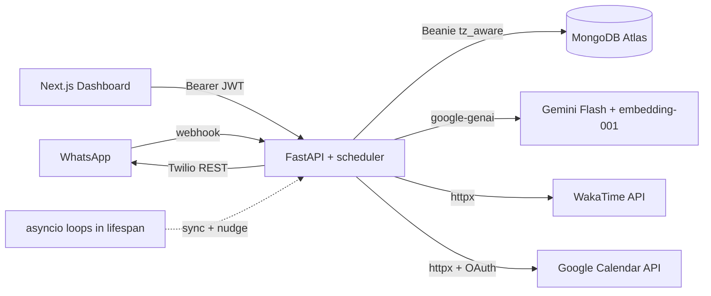

# Orbit — Project Context

## North Star

Build a personal AI copilot that helps its human get the **best output from their life** by knowing them deeply — profile, habits, goals, health, work, schedule, and live signals from connected tools — then guiding them proactively over WhatsApp.

**Core principle:** More accurate, timely context → better advice, nudges, and accountability.

**Success looks like:** Orbit knows who you are, what you're working toward, what happened yesterday (GitHub, WakaTime, Calendar), remembers what you told it weeks ago, and sends the right message at the right time — without you opening another app.

---

## Role and Objective

Act as a **Senior Full-Stack Engineer** specializing in event-driven serverless architectures, AI agent workflows, and the MERN-with-Python stack.

Orbit is a single-user-per-instance self-hosted prototype. It must be:

- Resilient against cold starts and one-replica deploys
- Highly modular so new data connectors and tools plug in cleanly
- Fast on the WhatsApp webhook path (under 10–15 seconds end-to-end)

---

## Tech Stack

| Layer | Choice |
| --- | --- |
| Backend API | FastAPI (Python 3.11+) — webhooks, cron, AI, DB, auth |
| Frontend Dashboard | Next.js App Router — settings UI + chat, calls FastAPI |
| Backend Hosting | AWS EC2 (Docker + Caddy) primary; Railway / Render / Fly / VPS supported |
| Frontend Hosting | Vercel |
| Database | MongoDB Atlas (Beanie async ODM on Motor, `tz_aware=True`) |
| Auth | bcrypt + JWT bearer (`python-jose`, `passlib`) |
| AI Engine | Gemini (`google-genai`) — `gemini-2.0-flash` for chat, `gemini-embedding-001` for memory (768-dim, MRL-truncated) |
| Interface | Twilio WhatsApp (Meta Cloud API optional later) |
| UI Library | Tailwind CSS v4, shadcn-style components |
| Encryption | Fernet (`cryptography`) for at-rest credential storage |

---

## Repository Layout

```
orbit/
  README.md
  context.md
  docs/
    deployment.md
    google_calendar_setup.md
  deploy/                                  # production docker-compose + Caddy
    docker-compose.yml
    Caddyfile
    .env.example
  server/
    Dockerfile
    Procfile + railway.toml                # managed-host alternative
    requirements.txt
    .env.example
    app/
      main.py
      core/                                # config, database, security, integration_security, phone, timezone, time_value
      models/                              # Beanie Documents (User, Integration, LongTermContext, ConversationMessage)
      schemas/                             # Pydantic API shapes
      integrations/
        whatsapp/twilio.py                 # signature validation + outbound send
        wakatime/                          # client.py + sync.py
        google_calendar/                   # oauth.py + client.py + sync.py
      api/
        deps.py + deps_cron.py             # JWT auth + cron-secret auth
        routes/                            # auth, chat, context, conversations, cron, dev, health,
                                           # integrations, public_config, users, webhook
      services/
        brain.py                           # process_message + process_proactive_check_in
        channels.py                        # InteractionChannel enum
        conversation.py
        embeddings.py                      # gemini-embedding-001 + cosine_similarity
        gemini.py                          # tool-calling loop
        memory_backfill.py
        memory_extraction.py
        integration_sync.py
        prompt.py                          # system instructions per AgentMode
        proactive.py                       # cron-level proactive orchestrator
        scheduler.py                       # in-process asyncio scheduler
        scheduling.py                      # per-user eligibility (rule gate)
        user_context.py                    # load_user_memories + load_live_signals
        context/
          bundle.py                        # ContextBundle + AgentMode + assemble_context
          sections.py                      # per-section renderers (profile, signals, history, "right now")
        tools/
          registry.py                      # build_user_tool_bindings
          snooze.py
          update_goals.py
          add_memory.py
          archive_memory.py
          calendar_events.py
  client/
    src/
      app/                                 # / (landing), /login, /register, /dashboard
      components/
        auth/                              # login-form, register-form, whatsapp-phone-input
        dashboard/                         # chat-tab, chat-markdown, profile-tab, memory-tab,
                                           # messaging-settings-tab, integrations-tab, dashboard-sidebar
        ui/                                # shadcn-style primitives
      contexts/                            # auth-context (JWT + serverConfig)
      lib/                                 # api, chat-api, conversation-api, context-api, integrations-api,
                                           # server-config-api, phone, format, location-options
      types/                               # auth, conversation, context, integration, user
    .env.local.example
```

---

## Models vs Schemas

| Layer | Location | Purpose |
| --- | --- | --- |
| **Models** | `server/app/models/` | Beanie `Document` classes — what is stored in MongoDB (includes secrets like `password_hash`, encrypted credentials, raw embeddings) |
| **Schemas** | `server/app/schemas/` | Pydantic `BaseModel` classes — what the HTTP API accepts/returns (never exposes secrets or embeddings) |
| **Profile embeds** | `server/app/models/user_profile.py` | Shared nested types (`UserContact`, `UserHealth`, `UserOrbitPreferences`, `WorkEntry`, etc.) reused by both models and schemas |

Route handlers translate between them. `PATCH /api/users/me` uses `model_fields_set` so nested updates stay typed.

---

## Database Models (Beanie)

### `User` (`users` collection)

Rich profile document with nested sections:

- **contact** — email, phone, WhatsApp number (WhatsApp indexed unique/sparse for webhook lookup)
- **identity** — display/legal/preferred name, DOB, gender, bio, avatar
- **location** — IANA timezone (validated), locale, city, region, country, nationality, languages
- **goals** — life mission, personal goals, short/long-term goal items, focus areas, weekly priorities
- **habits** — morning/evening routines, tracked habits, habits to build/break
- **health** — fitness, sleep target, bedtime/wake (stored as `HH:MM:SS` strings), diet, allergies, conditions, medications, health goals, notes
- **work** — multiple roles (`WorkEntry[]`); shared skills, productivity goals, career goals. Legacy single-job shape auto-migrates on load.
- **orbit_preferences** — communication style, **check_in_frequency** (`off | low | medium | high`), **proactive_nudges_enabled**, nickname, topics to avoid, custom instructions, **quiet_hours_start/end** (HH:MM strings), **snooze_until** (datetime), **last_proactive_check_in_at** (datetime)
- **emergency** — emergency contacts and notes
- **password_hash** — bcrypt only; never returned via API
- **is_active**, **is_verified**, timestamps

Time fields are **strings**, not Python `time` objects — Beanie/MongoDB cannot encode `datetime.time`.

### `ConversationMessage` (`conversation_messages` collection)

- **user** (Link), **role** (`user | assistant`), **content**, **channel** (`whatsapp | dashboard | dev`)
- **external_id** (Twilio SID or `proactive:<user_id>:<iso>`), **created_at**
- Save-time invariant: assistant `created_at` is `user_created_at + 1ms` to guarantee deterministic ordering even when Python clock resolution ties.
- Indexed by `(user, created_at)` and `(user, channel, created_at)`; routes sort by `(-created_at, -_id)` for tie-break stability.

### `LongTermContext` (`long_term_context` collection)

Persistent memory for prompt injection:

- **context_type** — `fact | preference | habit | health | work | relationship | goal_progress | conversation_summary | insight | other`
- **title**, **content**, **summary**
- **importance** (1–10), **confidence**, **source**, **source_ref**, **tags**, **metadata**
- **source** values: `manual`, `ai_inferred`, `whatsapp`, `dashboard`, `cron_sync`, `wakatime`, `github`, `google_calendar`
- **embedding** — `list[float] | None`, 768 dims via `gemini-embedding-001` MRL-truncation. Populated on insert by [services/embeddings.py](server/app/services/embeddings.py) `embed_memory_doc()` and backfillable via `POST /api/dev/backfill-embeddings`.
- **expires_at**, **is_archived**, **access_count**, **last_accessed_at**

### `Integration` (`integrations` collection)

- **user** (Link), **provider** (`github | wakatime | google_calendar`), **status** (`active | inactive | error`)
- **credentials** — dict where every value is Fernet-encrypted; per-provider keys are:
  - WakaTime: `api_key`
  - Google Calendar: `refresh_token`, `access_token`, `expires_at` (ISO string), `scope`
- **last_synced_at**, **last_sync_summary**, **last_sync_error**, timestamps
- Unique index on `(user, provider)`.

---

## API Endpoints

| Method | Path | Auth | Status |
| --- | --- | --- | --- |
| `GET` | `/health` | — | Done |
| `GET` | `/api/config` | — | Done — `{allow_registration}` |
| `POST` | `/api/webhook/whatsapp` | Twilio sig | Done |
| `POST` | `/api/auth/register` | — | Done (gated by `ALLOW_REGISTRATION`) |
| `POST` | `/api/auth/login` | — | Done (form: `username`=email) |
| `GET` | `/api/auth/me` | Bearer | Done |
| `GET/PATCH` | `/api/users/me` | Bearer | Done |
| `GET/POST` | `/api/context` | Bearer | Done (POST embeds the new memory) |
| `GET/PATCH/DELETE` | `/api/context/{id}` | Bearer | Done (DELETE archives) |
| `POST` | `/api/chat` | Bearer | Done — dashboard AI chat |
| `GET` | `/api/conversations/messages` | Bearer | Done — query `channel`, `limit` |
| `GET/POST/DELETE` | `/api/integrations` | Bearer | Done (POST is WakaTime-only) |
| `POST` | `/api/integrations/{id}/sync` | Bearer | Done — both providers |
| `POST` | `/api/integrations/oauth/google_calendar/start` | Bearer | Done — returns `{authorization_url}` |
| `GET` | `/api/integrations/oauth/google_calendar/callback` | state JWT | Done — exchanges code, stores tokens, redirects to dashboard |
| `POST` | `/api/cron/sync` | `CRON_SECRET` | Done — re-sync all integrations |
| `POST` | `/api/cron/nudge` | `CRON_SECRET` | Done — run proactive check-ins |
| `POST` | `/api/dev/chat` | dev gate | Done |
| `POST` | `/api/dev/proactive-nudge` | Bearer + dev gate | Done — force-fire for current user |
| `GET` | `/api/dev/context` | Bearer + dev gate | Done — inspect rendered prompt + bundle |
| `POST` | `/api/dev/backfill-embeddings` | Bearer + dev gate | Done |

Protected routes require header: `Authorization: Bearer <JWT>`.

---

## Environment Variables

```env
MONGODB_URI=...
MONGODB_DB_NAME=orbit

# openssl rand -hex 32
JWT_SECRET_KEY=...

CORS_ORIGINS=http://localhost:3000,http://127.0.0.1:3000

GEMINI_API_KEY=...
GEMINI_MODEL=gemini-2.0-flash

TWILIO_ACCOUNT_SID=...
TWILIO_AUTH_TOKEN=...
TWILIO_WHATSAPP_FROM=whatsapp:+14155238886
TWILIO_WEBHOOK_URL=https://your-domain/api/webhook/whatsapp
TWILIO_VALIDATE_SIGNATURES=false   # true in production

ENABLE_DEV_ROUTES=true              # false in production
ALLOW_REGISTRATION=true             # false after creating your account

# python -c "from cryptography.fernet import Fernet; print(Fernet.generate_key().decode())"
# Write-once. Rotating breaks all stored integration credentials.
INTEGRATION_ENCRYPTION_KEY=...
# openssl rand -hex 32 — only needed when using external cron
CRON_SECRET=...

FRONTEND_URL=http://localhost:3000

# Google Calendar OAuth — see docs/google_calendar_setup.md
GOOGLE_OAUTH_CLIENT_ID=...
GOOGLE_OAUTH_CLIENT_SECRET=...
GOOGLE_OAUTH_REDIRECT_URI=http://localhost:8000/api/integrations/oauth/google_calendar/callback

# In-process scheduler (single-instance default)
BACKGROUND_SCHEDULER_ENABLED=true
SCHEDULER_SYNC_INTERVAL_MINUTES=60
SCHEDULER_NUDGE_INTERVAL_MINUTES=15
```

**Dev notes:** Twilio sandbox `whatsapp:+14155238886`. Install `tzdata` on Windows for IANA timezone validation. Run ngrok for webhook testing.

---

## System Architecture & Core Flows

### 1. Unified brain with two modes

`process_message` (reactive) and `process_proactive_check_in` (proactive) live in [services/brain.py](server/app/services/brain.py) and share `assemble_context` + tool bindings. They differ only in:

- System instruction (proactive adds an addendum saying "you're initiating — lead with substance, return `<SKIP>` only for narrow reasons")
- "Current task" block (reactive shows the user's message; proactive shows a task description)
- Skip detection — proactive treats exact-match `<SKIP>` as "don't send"

```
Inbound (WhatsApp webhook | POST /api/chat | POST /api/dev/chat)
    → assemble_context(user, query=msg)
        → load_user_memories(user, query=msg)     # semantic via embeddings
        → load_live_signals(user)                  # WakaTime + Calendar
        → load_recent_messages(user)
    → bundle.render_prompt(mode=REACTIVE, channel, user_message)
    → build_user_tool_bindings(user)               # conditional on integrations
    → generate_orbit_reply(prompt, tools, system_instruction)
        → Gemini tool loop (max 5 iterations)
    → save_conversation_turn(user, assistant)
    → asyncio.create_task(extract_and_save_memories(...))   # background
    → return OrbitInteractionResult
```

### 2. Context assembly ([services/context/bundle.py](server/app/services/context/bundle.py))

`ContextBundle` is the single source of "what does the model know right now". The render order is:

1. `## Right now` — authoritative local time + part-of-day label (forces model away from UTC bias)
2. `## User profile` — identity, location, prefs, goals, work, health, habits, long-term memory hits
3. `## Live activity (synced from connected tools)` — WakaTime + Calendar rolling summaries
4. `## Recent conversation` — last 20 turns
5. `## Current task` — the user's message (reactive) or the proactive directive

### 3. Semantic memory retrieval ([services/user_context.py](server/app/services/user_context.py))

`load_user_memories(user, *, query=None, limit=12)`:

- Pulls all non-archived memories with `source NOT IN (wakatime, github, google_calendar, cron_sync)`.
- With `query`: embed it via `embed_text`, cosine against each memory's `embedding`, rank by `similarity + importance × 0.02` (tiebreaker only).
- Without `query` (proactive path): fall back to importance sort.
- Memories without embeddings (legacy / pre-backfill) get a low floor score so they're not preferred but not lost.

Integration-source memories are surfaced separately in the `## Live activity` section via `load_live_signals` to keep their format distinct.

### 4. Proactive scheduler ([services/scheduler.py](server/app/services/scheduler.py))

In-process asyncio tasks started in FastAPI's lifespan:

- `integration_sync` loop — every `SCHEDULER_SYNC_INTERVAL_MINUTES` (default 60): runs `sync_all_integrations()`.
- `proactive_nudge` loop — every `SCHEDULER_NUDGE_INTERVAL_MINUTES` (default 15): runs `run_proactive_check_ins()`.
- Staggered start (sync first, nudge +30s) so they don't fire in lockstep.
- Crashes are caught per-tick and logged; the loop continues.

For multi-replica deploys: set `BACKGROUND_SCHEDULER_ENABLED=false` and use external cron against `/api/cron/sync` and `/api/cron/nudge` with `CRON_SECRET`.

### 5. Two-gate proactive flow

For each user on each nudge tick:

**Rule gate** ([services/scheduling.py](server/app/services/scheduling.py)) — skip if any:
- `proactive_nudges_enabled = false`
- `check_in_frequency = "off"`
- `snooze_until > now`
- `now - last_proactive_check_in_at < interval` (intervals: `low`=12h, `medium`=4h, `high`=90m)
- Local time falls inside quiet hours (default 22:00–08:00 if user hasn't set them)

**Model gate** — proactive system addendum tells Gemini to return `<SKIP>` if there's nothing useful. Skip detection is exact-match (not substring) on the trimmed reply.

Only non-skip replies update `last_proactive_check_in_at`, get sent via Twilio (if WhatsApp linked), and get saved as an assistant `ConversationMessage`.

### 6. Tool framework ([services/tools/](server/app/services/tools/))

`build_user_tool_bindings(user)` returns a per-user list of `ToolBinding(declaration, handler)`:

| Tool | Always bound? | Purpose |
| --- | --- | --- |
| `snooze_check_ins` | Yes | Pause proactive nudges for N minutes (0 = clear) |
| `update_goals` | Yes | Add/remove from `personal_goals`, `weekly_priorities`, or `focus_areas` |
| `add_memory` | Yes | Explicit user-requested memory save (source=`manual`, embedded on insert) |
| `archive_memory` | Yes | Title-exact archive of a non-archived memory |
| `get_calendar_events` | Only if Calendar linked | Fetch events for a date range; auto-refreshes the access token |

[services/gemini.py](server/app/services/gemini.py) `generate_orbit_reply()` runs a manual tool loop (max 5 iterations): receives function_call parts, dispatches to handlers, appends function_response parts, re-calls Gemini until plain text returns or limit hit.

### 7. Memory write-back ([services/memory_extraction.py](server/app/services/memory_extraction.py))

After every reactive turn, fire-and-forget:

- Skip if user message < 8 chars (debounces "ok", "thanks").
- Follow-up Gemini call with `response_mime_type="application/json"` + `response_schema=ExtractedMemoryBatch`.
- System prompt biases toward empty list; instructs the model to skip transient questions, small talk, things already in existing memory titles.
- Post-pass: title-substring dedup against existing memories (case-insensitive), confidence threshold ≥ 0.5, max 3 saved per turn.
- Each saved memory gets embedded before insert.

### 8. Integration engine

**WakaTime** ([integrations/wakatime/](server/app/integrations/wakatime/)) — API-key auth via `Authorization: Basic`. Sync pulls 7-day summaries, normalizes "yesterday" + week totals + top languages/projects, upserts one rolling `LongTermContext` per user with `source_ref="wakatime:rolling"`, `importance=7`.

**Google Calendar** ([integrations/google_calendar/](server/app/integrations/google_calendar/)) — OAuth 2.0 authorization-code flow:

- `oauth.py` — signed-state JWT carries user_id through Google's redirect; `prompt=consent` + `access_type=offline` to guarantee a refresh token; scope check on callback verifies `calendar.readonly` was granted.
- `client.py` — async `list_events` against Calendar v3; raises `CalendarAuthError` on 401 so the sync layer can refresh.
- `sync.py` — `_ensure_access_token` auto-refreshes using stored refresh token (2-min skew buffer). Fetches today + tomorrow in user's timezone, computes free blocks (≥30 min between 08–20), upserts one rolling `LongTermContext` with `source_ref="google_calendar:rolling"`, `importance=8` (higher than WakaTime — calendar is more time-sensitive).

Both providers funnel through `_run_sync()` in [routes/integrations.py](server/app/api/routes/integrations.py) and [services/integration_sync.py](server/app/services/integration_sync.py). New integrations only need a `client.py` + `sync.py` + a branch in those two dispatchers.

### 9. Web Dashboard

Five-tab sidebar layout:

| Tab | Purpose | Status |
| --- | --- | --- |
| **Chat** (default) | Full-page ChatGPT-style UI with markdown rendering, suggestion chips, copy button, smart auto-scroll | Done |
| **Profile** | Identity, location (dropdowns), goals, multi-role work, health & habits, Orbit prefs | Done |
| **Memory** | Long-term memory + conversation history by channel | Partial — read works; edit/search/archive UI incomplete |
| **Messaging & automation** | WhatsApp number, frequency, quiet hours, snooze status, scheduler info | Done |
| **Integrations** | WakaTime (API key), Google Calendar (OAuth), GitHub (placeholder) | Done for the two shipped providers |

Sidebar footer shows the user profile card (avatar + name + email) with log-out icon. Public landing page hides Sign-up CTAs when `/api/config` reports `allow_registration: false`.



---

## Implementation Phases

### Phase 1: Foundation & Webhook — **Done**

- [x] FastAPI server, MongoDB (Beanie + Motor with `tz_aware=True`), health check
- [x] Twilio WhatsApp inbound webhook + outbound send + configurable signature validation
- [x] Outbound send error handling (webhook returns 200 even if send fails)
- [ ] Meta WhatsApp Cloud API (alternative provider)

### Phase 2: The Brain — **Done**

- [x] Gemini SDK integration (`google-genai`) with async client
- [x] Unified `process_message()` for WhatsApp, dashboard chat, dev chat
- [x] `process_proactive_check_in()` for Orbit-initiated turns
- [x] `AgentMode` (reactive | proactive) + per-mode system instructions
- [x] System prompt with `## Right now` authoritative time block at top
- [x] Tool-calling loop (max 5 iterations) over Gemini function calls
- [x] Conversation history saved + injected (last 20 turns, deterministic ordering)
- [x] `POST /api/chat`, `GET /api/conversations/messages`, `POST /api/dev/chat`
- [x] AI memory write-back (background extraction after each reactive turn)
- [x] Semantic memory retrieval (embeddings + cosine + importance tiebreaker)
- [ ] Prompt optimization — token budget manager, smarter section truncation
- [x] Twilio signature validation toggle for production

### Phase 3: Database & State — **Done**

- [x] Beanie models: `User`, `Integration`, `LongTermContext`, `ConversationMessage`
- [x] Auth: register, login, JWT, protected routes
- [x] Profile + context CRUD APIs
- [x] Webhook user resolution by WhatsApp number
- [x] Profile PATCH (nested models, time-as-string for MongoDB)
- [x] `ALLOW_REGISTRATION` flag for self-hosted lockdown
- [x] `tz_aware=True` Motor client so datetimes round-trip correctly

### Phase 4: Dashboard — **Mostly done**

- [x] Next.js app with auth, landing page, dashboard sidebar layout
- [x] Five-tab layout: Chat (default), Profile, Memory, Messaging & automation, Integrations
- [x] Dashboard AI chat — same brain as WhatsApp; markdown rendering, suggestions, copy button, smart auto-scroll
- [x] Profile editing via `PATCH /api/users/me`
- [x] Location/timezone/locale dropdowns
- [x] Multi-role work editor, personal goals field
- [x] Memory tab: long-term + conversation history by channel
- [x] Messaging tab: WhatsApp number, frequency, quiet hours, snooze
- [x] Integrations tab: WakaTime connect/sync/disconnect, Google Calendar OAuth flow with callback banner
- [x] Sidebar user profile card + responsive mobile
- [x] Server config fetched on mount; Sign-up CTAs hide when registration closed
- [ ] Memory edit / archive / search UI
- [ ] Onboarding checklist
- [ ] Live scheduler status (last tick timestamps)

### Phase 5: Connectors — **In progress**

- [x] `/api/integrations` CRUD + manual sync
- [x] Credential encryption at rest (Fernet via `INTEGRATION_ENCRYPTION_KEY`)
- [x] Connector module pattern (`server/app/integrations/{provider}/`)
- [x] WakaTime (API-key) — connected via Integrations tab, syncs into `LongTermContext`
- [x] Google Calendar (OAuth) — `oauth.py` + state JWT + token refresh + free-block computation
- [x] Real OAuth connect flow on the dashboard (Google) with success/error banner on callback
- [ ] GitHub connector (PAT or OAuth) — model only, not built

### Phase 6: Cron & Proactive Nudges — **Done**

- [x] `CRON_SECRET` auth middleware for cron routes
- [x] `POST /api/cron/sync` — pulls all active integrations
- [x] `POST /api/cron/nudge` — evaluates eligibility, sends WhatsApp
- [x] In-process scheduler (asyncio tasks in lifespan) — primary path
- [x] External-cron path supported (`BACKGROUND_SCHEDULER_ENABLED=false`)
- [x] Rule gate: `proactive_nudges_enabled`, `check_in_frequency`, `snooze_until`, interval-since-last, quiet hours
- [x] Model gate: proactive system addendum + `<SKIP>` token detection
- [x] Initial sync triggered immediately when an integration is connected

### Phase 7: Context Engine & Model Quality — **Ongoing**

- [x] Unified `assemble_context()` service with `ContextBundle`
- [x] Semantic retrieval (gemini-embedding-001, 768-dim, cosine)
- [x] Authoritative time block at top of prompt (anti-UTC-bias)
- [x] Conditional tool binding (calendar only when linked)
- [ ] Memory update-on-conflict — semantic match + LLM merge/replace/keep/skip decision
- [ ] Memory decay / pruning — auto-archive low-importance, unaccessed memories
- [ ] Token budget manager — cap memory section, prioritize by relevance score
- [ ] Evaluation harness (dev route or script with sample scenarios)
- [ ] Model A/B or fallback (`gemini-2.0-flash` vs lite vs pro by task)

### Phase 8: Deployment — **Done**

- [x] Docker + Caddy auto-TLS for EC2 (Section A of [docs/deployment.md](docs/deployment.md))
- [x] Railway/Render fallback (Procfile + railway.toml)
- [x] Self-hosting lockdown (`ALLOW_REGISTRATION=false` + frontend CTA hiding)
- [x] Production hardening checklist (signature validation, dev routes off, secrets rotated)

---

## Recommended Build Order (Next)

Sprint 5 ideas, ranked by leverage:

1. **Memory update-on-conflict** — when the extractor finds a candidate, semantic-search existing memories; if cosine > 0.85, LLM-decide merge/replace/keep/skip. Solves the "memories pile up over months" problem. ~half day.
2. **Memory edit/archive UI** — make the Memory tab usable as a curated knowledge base. Surface AI-inferred vs manual provenance, allow inline edits, bulk archive. UI polish, no backend change.
3. **GitHub connector** — third integration completes the dev productivity picture (commits, PRs, streak). PAT-based for v1; same pattern as WakaTime.
4. **Daily/weekly summary nudge** — dedicated structured proactive that synthesizes Calendar + WakaTime + memory at fixed local times (morning intentions, evening review).
5. **Memory decay** — nightly job archives `importance ≤ 4 AND source != "manual" AND last_accessed_at < 60d`. Keeps the long-term memory pool clean as it grows.

---

## Demo-readiness sprint (interview showcase)

Goal: make Orbit a strong, talkable demo for interviews — breadth (connectors), first impression (auth UI), depth (context engineering). Tackled one item at a time.

### A. Auth pages redesign — **Done**

- [x] Shared `AuthShell` ([client/src/components/auth/auth-shell.tsx](client/src/components/auth/auth-shell.tsx)) — VOXA dark split layout: branded radial-gradient stage (orbit mark, pixel headline, feature bullets) + form column; collapses to a single column on mobile.
- [x] `/login` and `/register` rewritten on top of it; forms re-skin to dark via semantic tokens; registration-closed gate preserved.

### B. Context inspector + quality audit — **Planned (do next)**

Context engineering is the hard part of agents and the standout depth feature.

1. **Audit** via `GET /api/dev/context` — verify the `## Right now` time block, live-signal freshness/labels, semantic-retrieval relevance (right memories for the query, not noise), stale/duplicate memories, prompt size.
2. **Context Inspector panel** (the demo gold) — a dashboard view that, for a typed query, shows exactly what the agent receives: retrieved memories with similarity scores, live signals, assembled sections, and a token count. Pitch: "transparency — here's the exact context the agent sees."
3. **Improvements that may fall out** — token-budget trimming by relevance score; expose retrieval scores; optionally wire memory update-on-conflict so memory doesn't accumulate contradictions across a long demo.

### C. More connectors — **Planned**

Existing connectors are dev/productivity-heavy (WakaTime, GitHub, Calendar, Gmail). Add other life domains for demo breadth + a pluggability story.

- **Google Fit** (OAuth — reuses the service-aware Google flow; talking point: "adding a Google service was nearly free") — closes the health/sleep gap Orbit models but can't yet see.
- **Todoist** (API token, like WakaTime — different auth model + tasks domain) — pairs with goals/proactive nudges.
- Each is the standard connector shape: `client.py` + `sync.py` + dispatch branch + conditional tool binding.

**Suggested order:** A (done) → B (context inspector) → C (connectors), so the inspector can verify new connectors land in context correctly.

---

## Development Rules

1. **Modularity** — Gemini prompting separate from webhook routing; connectors as pluggable modules; tools as registry entries; models separate from schemas.
2. **Single-instance assumption** — in-process scheduler is the default. Multi-replica deploys must flip `BACKGROUND_SCHEDULER_ENABLED=false` and run external cron.
3. **Prioritize speed** — webhook path under timeout; heavy work in background tasks (memory extraction is fire-and-forget).
4. **Strictly typed code** — Python (server) and TypeScript (client).
5. **Security** — never expose secrets in API responses; encrypt integration credentials; protect cron with `CRON_SECRET`; production: signature validation on, dev routes off, registration locked.
6. **Context is the product** — every feature answers: "Does this give Orbit more useful context about the user, or let it act on that context?"
7. **Datetimes are always UTC at rest, with tzinfo on the wire** — Mongo client uses `tz_aware=True`. Local times are derived per-user from `location.timezone` at render time.

---

## Working Agreement

- The user will provide step-by-step instructions; do not jump phases ahead without agreement.
- Do **not** remove existing functionality while adding new features.
- Do **not** remove any existing comments.
- Do **not** add new comments unless explicitly told to.
